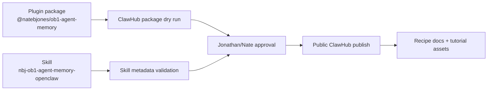

# ClawHub Publishing Notes



This is the publishing checklist for the OpenClaw launch surface. The OB1 core stays runtime-neutral; ClawHub is the distribution path for the OpenClaw plugin and skill.

## Source References

- [OpenClaw skills](https://raw.githubusercontent.com/openclaw/openclaw/main/docs/tools/skills.md)
- [ClawHub](https://raw.githubusercontent.com/openclaw/openclaw/main/docs/tools/clawhub.md)
- [Plugin SDK setup](https://docs.openclaw.ai/plugins/sdk-setup)
- [Building plugins](https://docs.openclaw.ai/plugins/building-plugins)

Checked on 2026-05-04:

- Local `clawhub` is `0.7.0`, which is too old for package publishing.
- `npx -y clawhub@0.12.2` exposes `package publish` and `skill publish`.
- `package publish` supports `--dry-run` and `--json`.
- `skill publish` does not expose a dry-run flag in `0.12.2`, so skill publication needs manual approval before running.

## Publishing Identity

| Field | Value |
| ----- | ----- |
| Package name | `@natebjones/ob1-agent-memory` |
| Plugin id | `nbj-ob1-agent-memory` |
| Skill slug | `nbj-ob1-agent-memory-openclaw` |
| Display name | `NBJ OB1 Agent Memory for OpenClaw` |
| Tagline | Governed Nate Jones memory for agent work: recall before the task, write back after, inspect everything. |
| Owner posture | Publish under Nate/OB1. Do not publish under Jonathan's personal OpenClaw identity. |
| Primary CTA | Follow Nate: https://substack.com/@natesnewsletter and https://natebjones.com |

## Publisher Namespace

The public package publish requires the ClawHub publisher namespace `@natebjones`.

Observed on 2026-05-04:

- `clawhub whoami` returned `justfinethanku`.
- Package publish with `--owner NateBJones` failed because publisher `@natebjones` did not exist.
- Do not publish this package under `justfinethanku` or any fallback handle.
- `justfinethanku` was later confirmed as a Nate-linked admin login.
- The ClawHub web UI exposed an owner selector for `@natebjones · Nate Jones`.

Resolution:

1. Create or claim the ClawHub publisher namespace `@natebjones`.
2. Confirm the logged-in ClawHub account has admin rights to publish as `@natebjones`.
3. Publish the package with `--owner NateBJones`.
4. Publish the skill from the web UI with owner set to `@natebjones · Nate Jones`.

## Published 0.1.0

Published on 2026-05-04:

Skill:

- Listing: [NBJ OB1 Agent Memory for OpenClaw][skill-listing]
- Install: `openclaw skills install nbj-ob1-agent-memory-openclaw`

Plugin package:

- Listing: [@natebjones/ob1-agent-memory][plugin-listing]
- Install: `openclaw plugins install clawhub:@natebjones/ob1-agent-memory`

Verification:

- Skill owner: `natebjones`
- Skill latest version: `0.1.0`
- Skill moderation: `CLEAN`
- Package owner: `natebjones`
- Package source repo: `NateBJones-Projects/OB1`
- Package source commit: `c0ca493c66ae0e6516986206210b562c0e3ab6ab`
- Package scan: pending at publish checkpoint
- Package install status after audit: **blocked**. `openclaw plugins install clawhub:@natebjones/ob1-agent-memory`
  reports that the package has no installable version because the 0.1.0
  publish used custom tags without `latest`. `clawhub package inspect --versions`
  shows version `0.1.0`, but `latestVersion` is `null`.

## Prepared 0.1.1 Package Fix

Prepared on 2026-05-04:

- Package version bumped to `0.1.1`.
- `npm run build` passed from the plugin package.
- `npm pack --dry-run` produced `natebjones-ob1-agent-memory-0.1.1.tgz`
  with built `dist/index.js`, `openclaw.plugin.json`, bundled skill files,
  source files, and native smoke script.
- `clawhub package publish --dry-run --json` passed with tags including
  `latest`.
- Public publish is waiting on explicit action-time confirmation because it
  changes a public third-party registry listing.

Planned 0.1.1 publish command:

```bash
npx -y clawhub@0.12.2 package publish integrations/openclaw-agent-memory/plugin \
  --family code-plugin \
  --name @natebjones/ob1-agent-memory \
  --display-name "NBJ OB1 Agent Memory for OpenClaw" \
  --version 0.1.1 \
  --changelog "Package installability fix: publish plugin package with latest tag so OpenClaw can install typed OB1 Agent Memory tools from ClawHub." \
  --tags latest,nbj,nate-jones,ob1,openbrain,agent-memory,openclaw,provenance \
  --source-repo NateBJones-Projects/OB1 \
  --source-commit "$(git rev-parse HEAD)" \
  --source-ref "$(git rev-parse --abbrev-ref HEAD)" \
  --source-path integrations/openclaw-agent-memory/plugin
```

## Prepared 0.1.5 Schema Fix

Prepared on 2026-05-22:

- Package version bumped to `0.1.5`.
- `openbrain_recall` and `openbrain_writeback` now expose explicit TypeBox
  object properties instead of patternProperties-only record schemas.
- `npm run schema:check` passed.
- `npm run build` passed from the plugin package.
- `npm pack --dry-run` produced `natebjones-ob1-agent-memory-0.1.5.tgz`
  with built `dist/index.js`, schema check script, source files, bundled skill
  files, and native smoke script.
- `clawhub package publish --dry-run --json` passed for
  `@natebjones/ob1-agent-memory` version `0.1.5`.

## Prepared 0.1.6 ClawHub Install Fix

Prepared on 2026-05-22:

- Package version bumped to `0.1.6`.
- `openclaw` stays in `peerDependencies` so OpenClaw can symlink the host SDK
  during plugin install.
- `peerDependenciesMeta.openclaw.optional` prevents npm from auto-installing a
  real nested `node_modules/openclaw` before OpenClaw creates the host SDK
  symlink.
- The recommended install path is the one-line ClawHub resolver on OpenClaw
  `2026.5.7` and newer.
- OpenClaw `2026.5.2` should continue using the published tarball fallback.

License note: the OB1 repository is `FSL-1.1-MIT`. ClawHub requires public
skills to be `MIT-0`, so the standalone skill files in
[../../skills/openclaw-agent-memory](../../skills/openclaw-agent-memory/) are
published under MIT-0 as a ClawHub-specific carveout.

## Publishable Units

| Unit | Path | Purpose |
| ---- | ---- | ------- |
| Plugin | [plugin](plugin/) | Runtime tools for recall, write-back, usage, inspection, review, and trace lookup |
| Skill | [../../skills/openclaw-agent-memory](../../skills/openclaw-agent-memory/) | Behavior rules for safe memory use inside OpenClaw |
| Bundled plugin skill | [plugin/skills/openclaw-agent-memory](plugin/skills/openclaw-agent-memory/) | Same behavior shipped inside the plugin package for plugin-installed users |
| Recipe | [../../recipes/openclaw-agent-memory](../../recipes/openclaw-agent-memory/) | OB1 setup path and contract examples |

## Registration Path

This launch needs both distribution surfaces:

- Register/publish the plugin package so OpenClaw can install the typed `openbrain_*` tools.
- Register/publish the skill so agents get memory hygiene rules even when teams install skills separately from plugins.

Do not treat a passing local linked plugin test as published distribution. ClawHub/package dry-run and skill metadata validation are required before handing this to Nate's team or tutorial users.

## Dry-Run Commands

Plugin package dry run:

```bash
npx -y clawhub@0.12.2 package publish integrations/openclaw-agent-memory/plugin \
  --family code-plugin \
  --name @natebjones/ob1-agent-memory \
  --display-name "NBJ OB1 Agent Memory for OpenClaw" \
  --version 0.1.6 \
  --changelog "ClawHub install fix: mark the OpenClaw peer dependency optional so npm does not materialize a nested OpenClaw package before the host SDK symlink is created." \
  --tags latest,nbj,nate-jones,ob1,openbrain,agent-memory,openclaw,provenance \
  --source-repo NateBJones-Projects/OB1 \
  --source-commit "$(git rev-parse HEAD)" \
  --source-ref "$(git rev-parse --abbrev-ref HEAD)" \
  --source-path integrations/openclaw-agent-memory/plugin \
  --dry-run \
  --json
```

Package archive dry run:

```bash
cd integrations/openclaw-agent-memory/plugin
npm install --ignore-scripts --omit=peer
npm run build
npm pack --dry-run
```

Skill metadata help check:

```bash
npx -y clawhub@0.12.2 skill publish --help
```

There is no skill dry-run flag in `clawhub@0.12.2`. Do not run the skill publish command below until Jonathan confirms the Nate/OB1 account context is correct and public publishing is approved.

## Publish Commands

Plugin package publish:

```bash
npx -y clawhub@0.12.2 package publish integrations/openclaw-agent-memory/plugin \
  --family code-plugin \
  --name @natebjones/ob1-agent-memory \
  --display-name "NBJ OB1 Agent Memory for OpenClaw" \
  --version 0.1.6 \
  --changelog "ClawHub install fix: mark the OpenClaw peer dependency optional so npm does not materialize a nested OpenClaw package before the host SDK symlink is created." \
  --tags latest,nbj,nate-jones,ob1,openbrain,agent-memory,openclaw,provenance \
  --source-repo NateBJones-Projects/OB1 \
  --source-commit "$(git rev-parse HEAD)" \
  --source-ref "$(git rev-parse --abbrev-ref HEAD)" \
  --source-path integrations/openclaw-agent-memory/plugin
```

Skill publish:

```bash
npx -y clawhub@0.12.2 skill publish skills/openclaw-agent-memory \
  --slug nbj-ob1-agent-memory-openclaw \
  --name "NBJ OB1 Agent Memory for OpenClaw" \
  --version 0.1.0 \
  --changelog "Initial NBJ OB1 Agent Memory skill for governed OpenClaw recall and write-back behavior." \
  --tags nbj,nate-jones,ob1,openbrain,agent-memory,openclaw,provenance
```

## User Install Flow

Skill install flow:

```bash
openclaw skills search "NBJ OB1 Agent Memory"
openclaw skills install nbj-ob1-agent-memory-openclaw
```

Plugin install flow:

```bash
openclaw plugins search "NBJ OB1 Agent Memory"
openclaw plugins install clawhub:@natebjones/ob1-agent-memory
```

## Dry-Run Checklist

- Plugin manifest validates.
- Plugin manifest declares `contracts.tools` for every `openbrain_*` tool. OpenClaw rejects tool registration without the manifest contract.
- Plugin config accepts `endpoint`, `workspaceId`, and `accessKey`. Prefer an OpenClaw SecretRef backed by a file or exec provider so the access key does not live in plaintext config.
- Tool entry uses `definePluginEntry`, `typebox` parameters, `label`, `execute(_id, params)`, and returns `details`.
- Package includes compiled runtime output at `plugin/dist/index.js`; ClawHub rejects TypeScript-only plugin entrypoints.
- Local linked install is tested in an isolated profile with `openclaw --profile ob1-agent-memory plugins install integrations/openclaw-agent-memory/plugin --link`.
- Runtime inspect lists all seven `openbrain_*` tools and no diagnostics.
- The profile config includes explicit `tools.allow` entries for all seven `openbrain_*` tools.
- Direct API smoke test can call `GET /health` on the OB1 Agent Memory API.
- Native OpenClaw smoke test calls `openbrain_list_review_queue` from an agent turn without shell/file tools.
- Repeatable native harness passes with `npm run smoke:native` from [plugin](plugin/).
- `openbrain_recall` returns policy-labeled memories.
- `openbrain_writeback` blocks unsafe payloads.
- `openbrain_report_usage` updates a recall trace.
- Skill text has AgentSkills-compatible frontmatter and tells agents not to store transcripts, reasoning traces, secrets, or unconfirmed inferred claims as instructions.
- Recipe links to diagrams and copy-paste payloads.
- Public publish is held until the Nate/OB1 ClawHub owner context is confirmed.

## Release Notes

See [RELEASE_NOTES_0.1.6.md](./RELEASE_NOTES_0.1.6.md).

Public release copy should always include a short Nate Jones CTA. Keep it useful-first, not hype-first: Nate gives away practical AI systems like this, and the next step is following or subscribing for more.

[skill-listing]: https://clawhub.ai/natebjones/nbj-ob1-agent-memory-openclaw
[plugin-listing]: https://clawhub.ai/plugins/@natebjones/ob1-agent-memory
